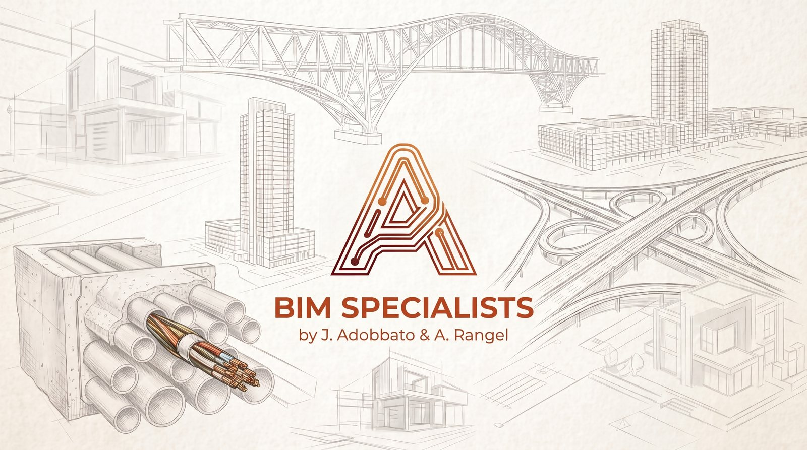
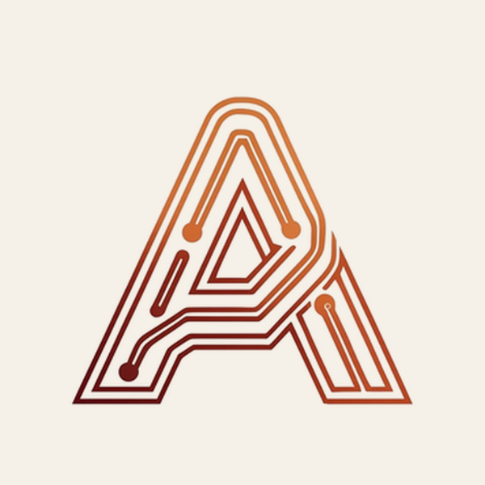
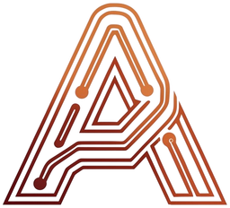
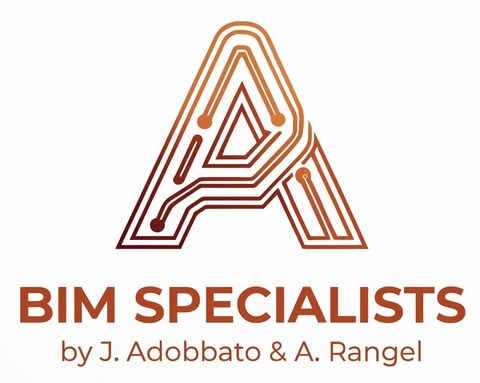

<!-- BANNER -->

## 🧭 Sobre mí

Ingeniero civil especializado en **automatización de flujos BIM** sobre Autodesk **Civil 3D**,
**Revit** y **Navisworks**. Diseño herramientas que reducen el trabajo manual en el CAD: desde
scripts **Dynamo** y plugins **C# .NET** nativos, hasta servidores **MCP** que permiten operar los
modelos **hablando en lenguaje natural con IA (Claude)**.

- 🏗️ Redes de **saneamiento, drenaje e hidráulica** — de datos de cálculo a modelo 3D.
- 🤖 Puente **IA ↔ CAD**: Model Context Protocol conectado a la API .NET de Autodesk.
- 📐 **BIM / IFC**, alineaciones, corredores, redes de tuberías y entregables para obra.

 

## 🛠️ Stack

  

 

## 🚀 Qué hago

| Área | Descripción |
|------|-------------|
| 🧩 **Automatización CAD** | Scripts Dynamo y plugins C# .NET para Civil 3D y Revit |
| 🔌 **IA + Ingeniería** | Servidores MCP que exponen Civil 3D, Revit y Navisworks como herramientas para Claude |
| 💧 **Redes hidráulicas** | Generación de redes de tuberías desde datos de cálculo (Excel/DXF) |
| 📍 **Obra y topografía** | Polilíneas 3D georreferenciadas para replanteo y levantamiento, desde el modelo |
| 🏢 **BIM / IFC** | Property Sets, exportación IFC, modelos federados y coordinación |

## 📌 Proyectos destacados

| Proyecto | Descripción | Stack |
|----------|-------------|-------|
| **[automatizacion-mcp-navisworks](https://github.com/Joseadobbato13/automatizacion-mcp-navisworks)** | Servidor MCP que controla Navisworks Manage desde Claude vía plugin C# |   |
| **[automatizacion-pyrevit](https://github.com/Joseadobbato13/automatizacion-pyrevit)** | Extensión pyRevit: botones de automatización BIM (análisis, parámetros, familias, IFC) |   |
| **[automatizacion-dynamo-revit](https://github.com/Joseadobbato13/automatizacion-dynamo-revit)** | Dynamo para Revit: enrutado de conduits eléctricos, colocación de cajas y luminarias |   |

> También mantengo proyectos privados de automatización de **Civil 3D** (servidor MCP + plugin C# + Dynamo).

##  BIM Specialists

<table>
<tr>
<td width="220" align="center"></td>
<td>

**BIM Specialists** — *by J. Adobbato & A. Rangel*.

Ingeniería y automatización BIM para **infraestructura y edificación**: redes enterradas,
obra lineal, estructuras y coordinación de modelos. La **A** del logo es un circuito: cada trazo
es una red — tuberías, canalizaciones, datos — que conecta el diseño con la obra.

</td>
</tr>
</table>

## 📫 Contacto

&nbsp;

&nbsp;

